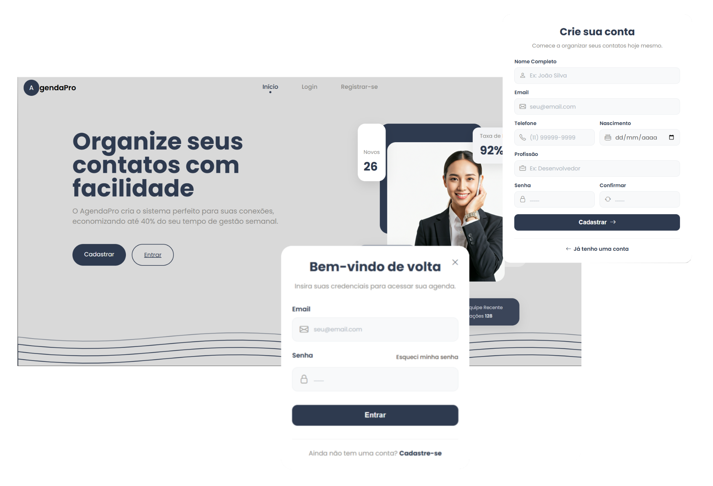
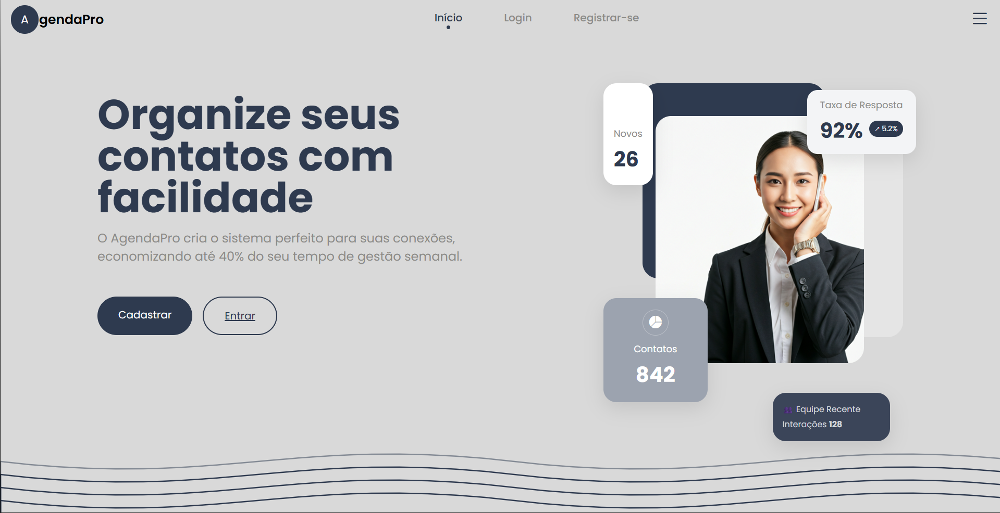
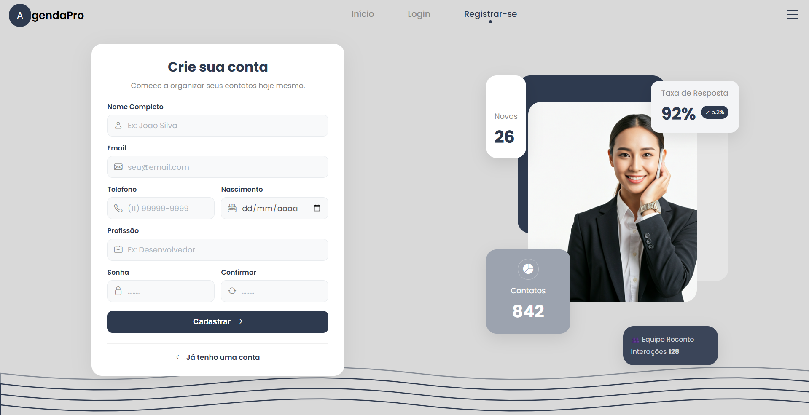
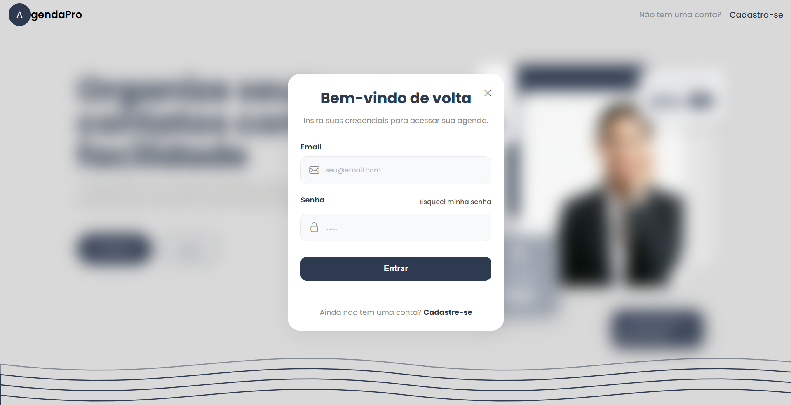
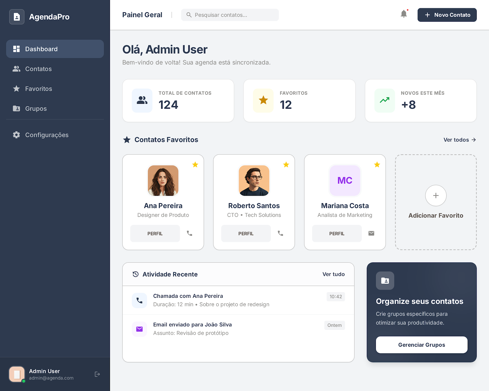

# Agenda de Contatos web - FrontEnd React

Acredito que, se você já viu os meus outros projetos, possa estar se perguntando:
>*"Por que tantas agendas de contatos!?"*

Apesar deste repositório específico ser dedicado ao *frontend*, a pergunta é um pouco mais profunda. Simples: A agenda de contatos oferece uma razoável complexidade em relação aos relacionamentos entre tabelas no banco de dados e entidades no backend. Desta forma, este tipo de projeto ajuda na consolidação das bases de conhecimento a nível de backend.



## Stack tecnológica e razões pelas quais as escolhi

Agora, de fato, sobre o frontend, escolhi o React.js e o React Router para fazer a construção das páginas.

> <p style="display:flex; gap:10px;" >Visto que o React.js tornou-se padrão para o desenvolvimento web, é pertinente adequar-me à stack tecnológica. 
</p>

Aprendi React há cerca de um mês e, para consolidar meus conhecimentos, me propus a criar um projeto. Visto que já havia criado uma agenda desktop com o JavaFX, o desenvolvimento de sua versão web pareceu ser lógico.

><p style="display:flex; gap:10px;">Seguindo o mesmo pensamento de utilidade de mercado, para fazer o gerenciamento das rotas do frontend optei pela biblioteca React Router</p>

## Conexão com API do backend

Por ter passado muito tempo focado no backend Java:

> Decidi usar o *FetchAPI* padrão do próprio JavaScript, por já ter visto no começo de meus estudos. Todos esses projetos visam consolidar conhecimentos que já possuo e colocá-los em prática, portanto o escolhi.

Apesar do padrão corporativo ser a biblioteca Axios, há suas semelhanças com o tradicional FetchAPI.

## Componentes e Organização dos diretórios

Para a estrutura de pastas do projeto, defini a separação dos componentes dentro de pastas próprias com seus respectivos arquivos de estilo. Em outras palavras, cada componente teria sua própria pasta contendo o arquivo .jsx e o .css, deste modo facilitando a manutenção dos componentes e favorecendo a organização:

```bash
src/
├── assets/             # Imagens e recursos estáticos
├── components/         # Blocos de interface reutilizáveis
│   ├── app/            # Componentes exclusivos da aplicação (Logado)
│   │   ├── contactsWidgets/
│   │   ├── dashboardHeader/
│   │   ├── favoriteContacts/
│   │   ├── organizeContacts/
│   │   ├── recentActivities/
│   │   └── sideBar/
│   ├── header/         # Componentes da Landing Page
│   ├── heroImage/
│   ├── homeComponent/
│   ├── loginComponent/
│   └── ...             # Outros componentes públicos
├── pages/              # Telas completas da aplicação
├── routes/             # Configuração de rotas (React Router)
```

## Design de Telas

Até a publicação deste README, as telas que estão em funcionamento são as telas dos caminhos:

- `http://localhost:5173`



- `http://localhost:5173/register`



- `http://localhost:5173/login`



Todas essas telas já estão em funcionamento em conjunto com o backend Spring, que pode ser visto no seguinte repositório:

[Repositório Backend Spring Boot](https://github.com/Thearckay/Agenda-contatos-Spring-JPA)

Atualmente o projeto segue em desenvolvimento com os sistemas internos da aplicação: (Design de exemplo)



### Finalização

Gostou do projeto ou gostaria de entrar em contato? Há um projetinho antigo mais funcional, onde pode encontrar meus contatos:

[Click aqui para entrar em Contato ;)](https://thearckay.github.io/linktree/)
